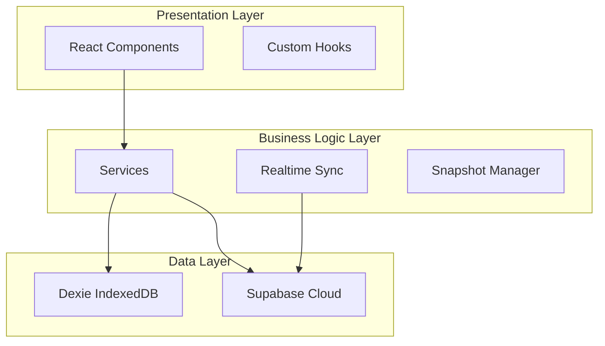
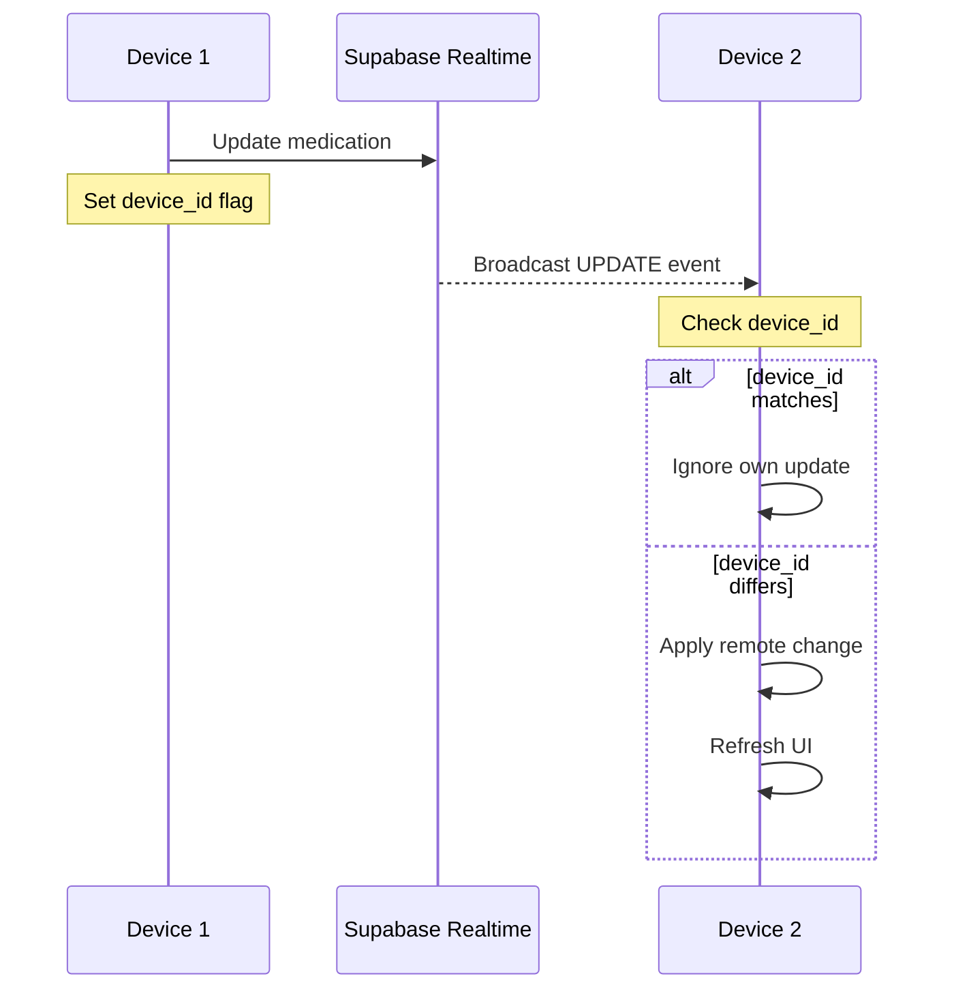
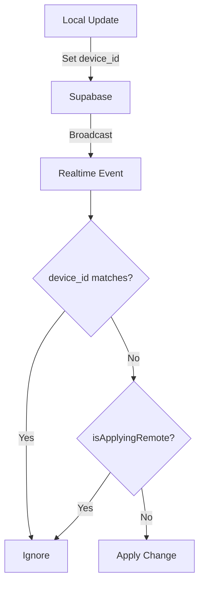
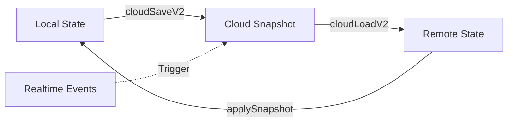
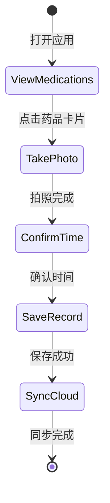
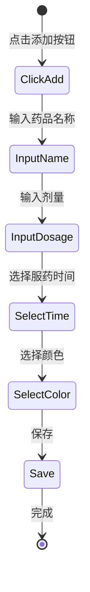
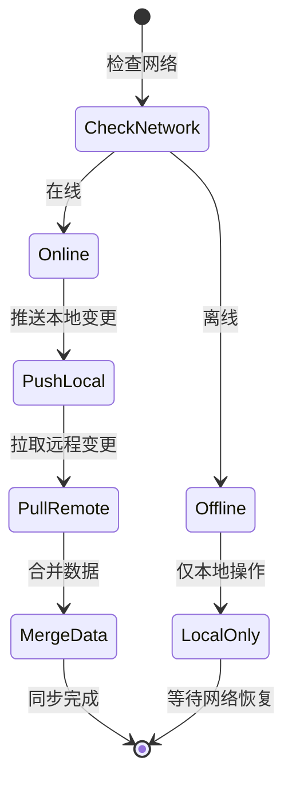
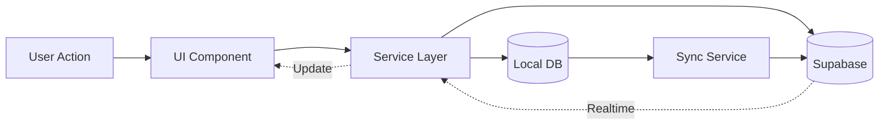

# 药盒助手 - 技术白皮书

**版本**: V260103.01  
**文档版本**: 1.0  
**最后更新**: 2026-01-03  
**作者**: 技术团队

---

## 目录

1. [执行摘要](#1-执行摘要)
2. [系统架构](#2-系统架构)
3. [核心功能特性](#3-核心功能特性)
4. [实时同步技术](#4-实时同步技术)
5. [数据持久化与快照](#5-数据持久化与快照)
6. [用户体验设计](#6-用户体验设计)
7. [PWA 特性](#7-pwa-特性)
8. [性能优化](#8-性能优化)
9. [安全与隐私](#9-安全与隐私)
10. [技术决策与权衡](#10-技术决策与权衡)
11. [未来规划](#11-未来规划)
12. [附录](#12-附录)

---

## 1. 执行摘要

### 1.1 产品定位与核心价值

**药盒助手**是一款面向老年人及慢性病患者的智能服药追踪应用。通过照片证据链、多设备实时同步和离线优先的设计理念，帮助用户准确记录和管理用药时间，提升用药依从性。

**核心价值主张**:
- **证据可信**: 基于照片 EXIF 时间戳的防篡改记录
- **多设备同步**: 家人可在不同设备上实时查看服药状态
- **离线优先**: 无网络环境下完全可用
- **老年友好**: 极简 UI，大字体，一键操作

### 1.2 技术栈概览

| 层级 | 技术选型 | 版本 | 用途 |
|------|---------|------|------|
| **前端框架** | React | 19.2.3 | UI 组件化开发 |
| **类型系统** | TypeScript | 5.8.2 | 类型安全 |
| **构建工具** | Vite | 6.2.0 | 快速构建与热更新 |
| **UI 库** | Tailwind CSS + Lucide React | - | 样式与图标 |
| **本地存储** | Dexie (IndexedDB) | 3.2.4 | 离线数据持久化 |
| **云端服务** | Supabase | 2.39.0 | PostgreSQL + Realtime + Storage |
| **图像处理** | EXIF.js + heic2any | - | EXIF 提取与 HEIC 转换 |
| **PWA** | Service Worker + Manifest | - | 离线支持与安装体验 |

### 1.3 关键技术亮点

1. **双向实时同步**: 基于 Supabase Realtime 的 WebSocket 连接，实现毫秒级多设备同步
2. **防无限循环机制**: 通过 `device_id` 标识和 `isApplyingRemote` 标志位避免循环更新
3. **EXIF 时间提取**: 从照片元数据中提取拍摄时间，防止时间篡改
4. **快照同步**: 完整应用状态的版本化快照，支持跨设备状态恢复
5. **离线优先架构**: 本地 IndexedDB + 云端 PostgreSQL 的混合存储策略

---

## 2. 系统架构

### 2.1 整体架构

药盒助手采用经典的三层架构设计，清晰分离表现层、业务逻辑层和数据层：



**架构特点**:
- **表现层**: React 组件负责 UI 渲染，通过 Hooks 管理状态
- **业务逻辑层**: Services 封装业务逻辑，Realtime 处理同步，Snapshot 管理快照
- **数据层**: 本地 IndexedDB 提供离线能力，Supabase 提供云端持久化和实时同步

### 2.2 技术栈详解

#### 前端框架: React 19.2.3
- **选择理由**: 生态成熟，性能优秀，TypeScript 支持完善
- **关键特性**: Hooks API，Concurrent Mode，Automatic Batching
- **使用模式**: 函数式组件 + Hooks，避免 Class 组件

#### 构建工具: Vite 6.2.0
- **选择理由**: 开发体验极佳，构建速度快，配置简单
- **关键特性**: ESM 原生支持，HMR 热更新，Rollup 打包
- **优化**: 代码分割，Tree Shaking，资源压缩

#### 本地存储: Dexie 3.2.4
- **选择理由**: IndexedDB 的高级封装，API 友好，支持 Promise
- **关键特性**: 事务管理，索引优化，版本迁移
- **数据模型**: 
  - `medications` 表: 药品主数据
  - `medicationLogs` 表: 服药记录（不可变）

#### 云端服务: Supabase 2.39.0
- **选择理由**: 开源，功能完整，免费额度充足
- **核心功能**:
  - **PostgreSQL**: 关系型数据库
  - **Realtime**: WebSocket 实时订阅
  - **Storage**: 照片存储
  - **Auth**: 身份认证
  - **RLS**: 行级安全策略

### 2.3 目录结构

```
meds/
├── public/                 # 静态资源
│   ├── manifest.json       # PWA 配置
│   ├── sw.js              # Service Worker
│   └── icon/              # 应用图标
├── src/
│   ├── components/        # React 组件
│   │   ├── CameraModal.tsx        # 拍照模态框
│   │   ├── LoginPage.tsx          # 登录页面
│   │   ├── SyncPrompt.tsx         # 同步提示
│   │   ├── SyncStatusIndicator.tsx # 同步状态指示器
│   │   ├── UpdateNotification.tsx  # 更新通知
│   │   └── AvatarUpload.tsx       # 头像上传
│   ├── services/          # 业务逻辑服务
│   │   ├── medication.ts          # 药品管理服务
│   │   ├── realtime.ts            # 实时同步服务
│   │   ├── sync.ts                # 数据同步服务
│   │   ├── snapshot.ts            # 快照管理服务
│   │   ├── userSettings.ts        # 用户设置服务
│   │   ├── conflict-resolver.ts   # 冲突解决服务
│   │   └── storage.ts             # 存储服务
│   ├── db/                # 数据库层
│   │   └── localDB.ts             # Dexie 封装
│   ├── lib/               # 第三方库封装
│   │   ├── supabase.ts            # Supabase 客户端
│   │   └── cloudbase.ts           # CloudBase 客户端（备用）
│   ├── types/             # TypeScript 类型定义
│   │   └── index.ts               # 核心类型
│   ├── utils/             # 工具函数
│   │   ├── exif.ts                # EXIF 提取
│   │   ├── crypto.ts              # 加密工具
│   │   ├── networkCheck.ts        # 网络检测
│   │   └── index.ts               # 通用工具
│   ├── config/            # 配置文件
│   │   └── version.ts             # 版本配置
│   └── sw-register.ts     # Service Worker 注册
├── App.tsx                # 主应用组件
├── index.html             # HTML 入口
├── vite.config.ts         # Vite 配置
├── tsconfig.json          # TypeScript 配置
└── package.json           # 依赖配置
```

**设计原则**:
- **关注点分离**: 组件、服务、数据层各司其职
- **模块化**: 每个文件职责单一，便于维护
- **可测试性**: 服务层与 UI 层解耦，便于单元测试

---

## 3. 核心功能特性

### 3.1 药品管理

#### 数据模型

基于 [`src/types/index.ts`](src/types/index.ts) 定义的 `Medication` 接口：

```typescript
export interface Medication {
  id: string;                    // UUID
  user_id?: string;              // 用户 ID
  name: string;                  // 药品名称
  dosage: string;                // 剂量（如 "1片"）
  scheduled_time: string;        // 计划服药时间（HH:mm 格式）
  created_at?: string;           // 创建时间（ISO 8601）
  accent?: string;               // 自定义颜色（如 "lime", "berry", "mint"）
}
```

#### CRUD 操作

通过 [`src/services/medication.ts`](src/services/medication.ts) 实现：

- **Create**: `upsertMedication(med: Medication)` - 添加或更新药品
- **Read**: `getTodayMedications()` - 获取今日药品列表
- **Update**: `upsertMedication(med: Medication)` - 更新药品信息
- **Delete**: `deleteMedication(medicationId: string)` - 删除药品

#### 本地存储

使用 Dexie IndexedDB 实现离线访问：

```typescript
// 数据库定义
class LocalDatabase extends Dexie {
  medications!: Dexie.Table<Medication, string>;
  medicationLogs!: Dexie.Table<MedicationLog, string>;

  constructor() {
    super('MedicationTrackerDB');
    this.version(1).stores({
      medications: 'id, user_id, name, scheduled_time',
      medicationLogs: 'id, medication_id, user_id, taken_at, sync_state, [medication_id+taken_at]'
    });
  }
}
```

**索引策略**:
- `id`: 主键索引
- `user_id`: 用户过滤
- `scheduled_time`: 时间排序
- `[medication_id+taken_at]`: 复合索引，快速查询特定药品的服药记录

### 3.2 服药记录与证据链

#### 照片证据

通过 [`src/components/CameraModal.tsx`](src/components/CameraModal.tsx) 实现拍照功能：

1. **调用摄像头**: 使用 `navigator.mediaDevices.getUserMedia()`
2. **拍照**: Canvas API 捕获视频帧
3. **HEIC 转换**: 使用 `heic2any` 库转换 iOS HEIC 格式
4. **压缩**: Canvas API 压缩到合理大小（< 1MB）

#### EXIF 时间提取

使用 [`src/utils/exif.ts`](src/utils/exif.ts) 提取照片元数据：

```typescript
export interface ExifResult {
  takenAt: Date | null;      // 拍摄时间
  source: TimeSource;        // 时间来源
}

export type TimeSource = 'exif' | 'system' | 'manual';
```

**时间源分级**（优先级从高到低）:
1. **EXIF**: 从照片 EXIF 数据中提取（最可信）
2. **System**: 使用系统当前时间（次可信）
3. **Manual**: 用户手动输入（最不可信）

#### 状态判定

基于计划时间和实际时间的差异判定服药状态：

```typescript
export type LogStatus = 'ontime' | 'late' | 'manual' | 'suspect';
```

- **ontime**: 在计划时间 ±30 分钟内
- **late**: 超过计划时间 30 分钟以上
- **manual**: 手动输入时间
- **suspect**: 可疑记录（如 EXIF 时间异常）

#### 防篡改机制

使用 SHA-256 哈希防止照片篡改：

```typescript
// 计算图片哈希
import CryptoJS from 'crypto-js';

export function calculateImageHash(imageData: string): string {
  return CryptoJS.SHA256(imageData).toString();
}
```

**数据模型**:

```typescript
export interface MedicationLog {
  id: string;
  medication_id: string;
  taken_at: string;           // 服药时间（EXIF 或降级时间）
  uploaded_at: string;        // 上传时间
  time_source: TimeSource;    // 时间来源
  status: LogStatus;          // 状态
  image_path?: string;        // 照片路径
  image_hash?: string;        // SHA-256 哈希
  sync_state?: SyncState;     // 同步状态
}
```

### 3.3 智能提醒系统

#### 定时提醒

基于 `scheduled_time` 字段实现定时提醒：

```typescript
// 检查是否需要提醒
function shouldNotify(medication: Medication): boolean {
  const now = new Date();
  const scheduledTime = parseTime(medication.scheduled_time);
  const diff = scheduledTime.getTime() - now.getTime();
  
  // 提前 5 分钟提醒
  return diff > 0 && diff <= 5 * 60 * 1000;
}
```

#### 浏览器通知

使用 Notification API 发送通知：

```typescript
// 请求通知权限
async function requestNotificationPermission() {
  if ('Notification' in window) {
    const permission = await Notification.requestPermission();
    return permission === 'granted';
  }
  return false;
}

// 发送通知
function sendNotification(medication: Medication) {
  new Notification('服药提醒', {
    body: `该服用 ${medication.name} 了`,
    icon: '/icon/192x192.png',
    badge: '/icon/192x192.png',
    tag: medication.id,
    requireInteraction: true
  });
}
```

#### 未来扩展

- **服务端推送**: 使用 Web Push API 实现后台推送
- **智能提醒**: 基于用户习惯调整提醒时间
- **语音提醒**: 集成语音播报功能

### 3.4 数据可视化

#### 今日进度

环形进度条显示今日完成率：

```typescript
const ProgressRing: React.FC<{ percentage: number }> = ({ percentage }) => {
  const radius = 45;
  const circumference = 2 * Math.PI * radius;
  const offset = circumference - (percentage / 100) * circumference;
  
  return (
    <svg className="w-full h-full transform -rotate-90">
      <circle
        cx="50%" cy="50%" r={`${radius}%`}
        className="stroke-gray-200 fill-none"
        strokeWidth="8"
      />
      <circle
        cx="50%" cy="50%" r={`${radius}%`}
        className="stroke-green-500 fill-none"
        strokeWidth="8"
        strokeDasharray={circumference}
        strokeDashoffset={offset}
        strokeLinecap="round"
      />
    </svg>
  );
};
```

#### 历史时间线

最近 7 天服药记录的时间线视图：

```typescript
// 加载时间线数据
const allLogs = await getMedicationLogs();
const sevenDaysAgo = new Date();
sevenDaysAgo.setDate(sevenDaysAgo.getDate() - 7);

const recentLogs = allLogs
  .filter(log => new Date(log.taken_at) >= sevenDaysAgo)
  .sort((a, b) => new Date(b.taken_at).getTime() - new Date(a.taken_at).getTime());
```

#### 统计分析

- **按时率**: `ontime` 记录数 / 总记录数
- **漏服率**: 未服药天数 / 总天数
- **趋势分析**: 7 天、30 天、90 天的服药趋势

---

## 4. 实时同步技术

### 4.1 多设备同步架构

药盒助手支持多设备实时同步，家人可在不同设备上实时查看服药状态：



**同步流程**:
1. 设备 1 更新药品数据，设置 `device_id` 字段
2. Supabase 通过 WebSocket 广播 UPDATE 事件
3. 设备 2 收到事件，检查 `device_id`
4. 如果是自己的更新，忽略；否则应用远程变更并刷新 UI

### 4.2 Realtime 实现

#### 核心文件

[`src/services/realtime.ts`](src/services/realtime.ts) - 实时同步核心逻辑

#### 技术选型

**Supabase Realtime** (基于 Phoenix Channels)：
- **协议**: WebSocket
- **特性**: 自动重连，订阅管理，过滤器支持
- **延迟**: < 100ms（同一区域）

#### 订阅表

```typescript
export async function initRealtimeSync(callbacks: RealtimeCallbacks): Promise<() => void> {
  const userId = await getCurrentUserId();
  const deviceId = getDeviceId();
  
  const channel = supabase
    .channel(`meds_sync_${deviceId}`)
    // 订阅 medications 表
    .on('postgres_changes', {
      event: 'UPDATE',
      schema: 'public',
      table: 'medications',
      filter: `user_id=eq.${userId}`
    }, handleMedicationChange)
    // 订阅 medication_logs 表
    .on('postgres_changes', {
      event: '*',
      schema: 'public',
      table: 'medication_logs'
    }, handleLogChange)
    // 订阅 user_settings 表
    .on('postgres_changes', {
      event: 'UPDATE',
      schema: 'public',
      table: 'user_settings',
      filter: `user_id=eq.${userId}`
    }, handleSettingsChange)
    .subscribe();
  
  return () => supabase.removeChannel(channel);
}
```

#### 设备识别

每个设备生成唯一 `device_id`：

```typescript
export function getDeviceId(): string {
  let deviceId = localStorage.getItem('device_id');
  
  if (!deviceId) {
    // 生成唯一设备 ID: device_timestamp_randomString
    deviceId = `device_${Date.now()}_${Math.random().toString(36).substring(2, 15)}`;
    localStorage.setItem('device_id', deviceId);
  }
  
  return deviceId;
}
```

#### 自我过滤

通过 `device_id` 避免处理自己的更新：

```typescript
function handleMedicationChange(payload: any) {
  const newData = payload.new;
  const currentDeviceId = getDeviceId();
  
  // 检查是否是自己设备的更新
  if (newData.device_id === currentDeviceId) {
    console.log('[Realtime] 忽略自己设备的更新');
    return;
  }
  
  // 应用远程变更
  callbacks.onMedicationChange?.();
}
```

### 4.3 冲突解决策略

#### 核心文件

[`src/services/conflict-resolver.ts`](src/services/conflict-resolver.ts) - 冲突解决逻辑

#### 冲突检测

比较本地和远程记录的 `updated_at` 和 `image_hash`：

```typescript
export function detectConflict(
  local: MedicationLog,
  remote: MedicationLog
): ConflictInfo | null {
  // 如果 image_hash 不同，说明是不同的记录
  if (local.image_hash !== remote.image_hash) {
    return {
      local,
      remote,
      reason: '照片内容不同'
    };
  }
  
  // 如果 updated_at 不同，说明有并发修改
  if (local.updated_at !== remote.updated_at) {
    return {
      local,
      remote,
      reason: '并发修改'
    };
  }
  
  return null;
}
```

#### 解决策略

**Last-Write-Wins (LWW)** 基于 `updated_at`：

```typescript
export function resolveConflict(conflict: ConflictInfo): MedicationLog {
  const localTime = new Date(conflict.local.updated_at || 0).getTime();
  const remoteTime = new Date(conflict.remote.updated_at || 0).getTime();
  
  // 选择最新的记录
  return remoteTime > localTime ? conflict.remote : conflict.local;
}
```

#### 用户介入

对于关键冲突（如照片不同），提示用户选择：

```typescript
// 显示冲突提示
<SyncPrompt
  conflict={conflict}
  onResolve={(choice) => {
    if (choice === 'local') {
      // 保留本地版本
      pushLocalChanges();
    } else {
      // 使用远程版本
      mergeRemoteLog(conflict.remote);
    }
  }}
/>
```

### 4.4 防无限循环机制

#### 问题描述

本地更新 → 触发 Realtime 事件 → 应用远程变更 → 触发本地更新 → 无限循环

#### 解决方案

**1. `isApplyingRemote` 标志位**

```typescript
let isApplyingRemote = false;

export function isApplyingRemoteChange(): boolean {
  return isApplyingRemote;
}
```

**2. `runWithRemoteFlag()` 包装器**

```typescript
export async function runWithRemoteFlag(fn: () => Promise<void>): Promise<void> {
  isApplyingRemote = true;
  try {
    await fn();
  } finally {
    // 延迟重置标志，确保所有同步操作完成
    setTimeout(() => {
      isApplyingRemote = false;
    }, 2000);
  }
}
```

**3. 2000ms 延迟重置**

确保所有 Realtime 事件在标志重置前到达，避免误判。

**4. `device_id` 匹配检查**

```typescript
// 在 Realtime 回调中检查
if (newData.device_id === currentDeviceId) {
  return; // 忽略自己的更新
}

if (!isApplyingRemote && callbacks.onMedicationChange) {
  callbacks.onMedicationChange();
}
```

#### 完整流程



---

## 5. 数据持久化与快照

### 5.1 本地存储 (IndexedDB)

#### 技术选型

**Dexie 3.2.4** - IndexedDB 的高级封装：
- **优势**: Promise API，事务管理，版本迁移，TypeScript 支持
- **性能**: 异步操作，不阻塞 UI
- **容量**: 通常 > 50MB（取决于浏览器）

#### 表结构

```typescript
class LocalDatabase extends Dexie {
  medications!: Dexie.Table<Medication, string>;
  medicationLogs!: Dexie.Table<MedicationLog, string>;

  constructor() {
    super('MedicationTrackerDB');
    
    this.version(1).stores({
      medications: 'id, user_id, name, scheduled_time',
      medicationLogs: 'id, medication_id, user_id, taken_at, sync_state, [medication_id+taken_at]'
    });
  }
}
```

#### 索引策略

- **medications 表**:
  - `id`: 主键，UUID
  - `user_id`: 用户过滤
  - `scheduled_time`: 时间排序

- **medicationLogs 表**:
  - `id`: 主键，UUID
  - `medication_id`: 外键，关联药品
  - `[medication_id+taken_at]`: 复合索引，快速查询特定药品的服药记录

#### CRUD 操作

```typescript
// Create/Update
export async function upsertMedication(med: Medication): Promise<void> {
  await db.medications.put(med);
}

// Read
export async function getMedications(): Promise<Medication[]> {
  return await db.medications.toArray();
}

// Delete
export async function deleteMedication(medicationId: string): Promise<void> {
  await db.medications.delete(medicationId);
}

// Query with index
export async function getMedicationLogs(medicationId?: string): Promise<MedicationLog[]> {
  if (medicationId) {
    return await db.medicationLogs
      .where('medication_id')
      .equals(medicationId)
      .toArray();
  }
  return await db.medicationLogs.toArray();
}
```

### 5.2 云端存储 (Supabase)

#### PostgreSQL 表结构

**medications 表** - 药品主表:

```sql
CREATE TABLE medications (
  id UUID PRIMARY KEY DEFAULT uuid_generate_v4(),
  user_id UUID NOT NULL REFERENCES auth.users(id),
  device_id TEXT,
  name TEXT NOT NULL,
  dosage TEXT NOT NULL,
  scheduled_time TEXT NOT NULL,
  accent TEXT,
  created_at TIMESTAMPTZ DEFAULT NOW(),
  updated_at TIMESTAMPTZ DEFAULT NOW()
);

CREATE INDEX idx_medications_user_id ON medications(user_id);
CREATE INDEX idx_medications_device_id ON medications(device_id);
```

**medication_logs 表** - 服药记录表:

```sql
CREATE TABLE medication_logs (
  id UUID PRIMARY KEY DEFAULT uuid_generate_v4(),
  user_id UUID NOT NULL REFERENCES auth.users(id),
  medication_id UUID NOT NULL REFERENCES medications(id) ON DELETE CASCADE,
  taken_at TIMESTAMPTZ NOT NULL,
  uploaded_at TIMESTAMPTZ NOT NULL,
  time_source TEXT NOT NULL CHECK (time_source IN ('exif', 'system', 'manual')),
  status TEXT NOT NULL CHECK (status IN ('ontime', 'late', 'manual', 'suspect')),
  image_path TEXT,
  image_hash TEXT,
  source_device TEXT,
  created_at TIMESTAMPTZ DEFAULT NOW(),
  updated_at TIMESTAMPTZ DEFAULT NOW(),
  UNIQUE(medication_id, taken_at)
);

CREATE INDEX idx_logs_user_id ON medication_logs(user_id);
CREATE INDEX idx_logs_medication_id ON medication_logs(medication_id);
CREATE INDEX idx_logs_taken_at ON medication_logs(taken_at DESC);
```

**user_settings 表** - 用户设置:

```sql
CREATE TABLE user_settings (
  user_id UUID PRIMARY KEY REFERENCES auth.users(id),
  settings JSONB NOT NULL DEFAULT '{}',
  created_at TIMESTAMPTZ DEFAULT NOW(),
  updated_at TIMESTAMPTZ DEFAULT NOW()
);
```

**app_snapshots 表** - 应用快照:

```sql
CREATE TABLE app_snapshots (
  id UUID PRIMARY KEY DEFAULT uuid_generate_v4(),
  owner_id UUID NOT NULL REFERENCES auth.users(id),
  key TEXT NOT NULL DEFAULT 'default',
  payload JSONB NOT NULL,
  version INTEGER NOT NULL DEFAULT 1,
  updated_at TIMESTAMPTZ DEFAULT NOW(),
  updated_by TEXT,
  updated_by_name TEXT,
  UNIQUE(owner_id, key)
);

CREATE INDEX idx_snapshots_owner_id ON app_snapshots(owner_id);
```

#### Storage - 照片存储

```typescript
// 上传照片
export async function uploadImage(
  userId: string,
  logId: string,
  imageData: string
): Promise<string> {
  const fileName = `${userId}/${logId}.jpg`;
  
  const { data, error } = await supabase.storage
    .from('medication-photos')
    .upload(fileName, dataURLtoBlob(imageData), {
      contentType: 'image/jpeg',
      upsert: true
    });
  
  if (error) throw error;
  
  return data.path;
}

// 获取照片 URL
export function getImageUrl(path: string): string {
  const { data } = supabase.storage
    .from('medication-photos')
    .getPublicUrl(path);
  
  return data.publicUrl;
}
```

### 5.3 快照同步机制

#### 核心文件

[`src/services/snapshot.ts`](src/services/snapshot.ts) - 快照管理核心

#### 快照内容

完整应用状态的 JSON 快照：

```typescript
export interface SnapshotPayload {
  medications: Medication[];
  medicationLogs: MedicationLog[];
  userSettings: UserSettings;
  version: number;
  timestamp: string;
}
```

#### 同步时机

1. **用户主动保存**: 点击"保存到云端"按钮
2. **定时自动保存**: 每 5 分钟自动保存（如有变更）
3. **设备切换时**: 新设备首次登录时拉取快照

#### 版本控制

基于 `version` 字段的乐观锁：

```typescript
export async function cloudSaveV2(): Promise<SaveResult> {
  const userId = await getCurrentUserId();
  const deviceId = getDeviceId();
  
  // 获取当前快照
  const currentSnapshot = await getCurrentSnapshotPayload();
  
  // 尝试更新
  const { data, error } = await supabase
    .from('app_snapshots')
    .upsert({
      owner_id: userId,
      key: 'default',
      payload: currentSnapshot,
      version: currentSnapshot.version + 1,
      updated_by: deviceId,
      updated_at: new Date().toISOString()
    })
    .select()
    .single();
  
  if (error) {
    // 版本冲突，需要合并
    if (error.code === '23505') {
      return { success: false, message: '版本冲突，请刷新后重试' };
    }
    throw error;
  }
  
  return { success: true, version: data.version };
}
```

#### 快照同步流程



**流程说明**:
1. **保存**: `cloudSaveV2()` 将本地状态保存到云端快照
2. **加载**: `cloudLoadV2()` 从云端拉取最新快照
3. **应用**: `applySnapshot()` 将快照应用到本地状态
4. **触发**: Realtime 事件可触发快照同步

### 5.4 离线支持

#### 读取操作

完全离线可用，直接从 IndexedDB 读取：

```typescript
// 离线读取药品列表
export async function getTodayMedications(): Promise<Medication[]> {
  // 直接从本地数据库读取，无需网络
  return await getMedications();
}
```

#### 写入操作

本地优先，标记 `sync_state: 'dirty'`：

```typescript
export async function addMedicationLog(log: MedicationLog): Promise<void> {
  // 标记为未同步
  log.sync_state = 'dirty';
  
  // 保存到本地数据库
  await db.medicationLogs.put(log);
  
  // 尝试同步到云端（如果在线）
  if (navigator.onLine) {
    try {
      await pushLocalChanges();
    } catch (error) {
      console.error('同步失败，将在网络恢复后重试', error);
    }
  }
}
```

#### 同步队列

网络恢复后自动推送未同步的记录：

```typescript
// 监听网络状态
window.addEventListener('online', async () => {
  console.log('网络已恢复，开始同步...');
  
  // 推送未同步的记录
  await pushLocalChanges();
  
  // 拉取远程变更
  await pullRemoteChanges();
});

// 推送本地变更
export async function pushLocalChanges(): Promise<void> {
  const unsynced = await getUnsyncedLogs();
  
  for (const log of unsynced) {
    try {
      const { error } = await supabase
        .from('medication_logs')
        .upsert(log);
      
      if (!error) {
        // 标记为已同步
        await markLogSynced(log.id);
      }
    } catch (error) {
      console.error('同步失败:', log.id, error);
    }
  }
}
```

---

## 6. 用户体验设计

### 6.1 UI/UX 原则

#### 极简主义

- **配色**: 黑白为主，辅以少量彩色强调
- **字体**: 使用 Inter 字体，清晰易读
- **布局**: 大量留白，减少视觉干扰

#### 老年友好

- **大按钮**: 最小触摸目标 48x48px
- **清晰图标**: 使用 Lucide React 图标库，简洁明了
- **简单流程**: 每个操作不超过 3 步

#### 视觉层次

使用巨大的斜体标题营造视觉冲击：

```tsx
<h2 className="text-6xl md:text-8xl font-black italic tracking-tighter uppercase leading-none text-black">
  TODAY
</h2>
```

**设计特点**:
- `text-8xl`: 超大字号（6rem / 96px）
- `font-black`: 最粗字重（900）
- `italic`: 斜体，增加动感
- `tracking-tighter`: 紧密字间距
- `uppercase`: 全大写，强调重要性

#### 响应式设计

移动优先，适配各种屏幕：

```tsx
<div className="w-full max-w-6xl mx-auto px-4 md:px-8">
  {/* 内容 */}
</div>
```

**断点策略**:
- `default`: < 640px（手机）
- `md`: ≥ 768px（平板）
- `lg`: ≥ 1024px（桌面）

### 6.2 交互流程

#### 服药流程



**流程说明**:
1. **打开应用**: 显示今日药品列表
2. **点击药品卡片**: 打开拍照模态框
3. **拍照完成**: 自动提取 EXIF 时间
4. **确认时间**: 用户确认或修改时间
5. **保存记录**: 保存到本地数据库
6. **同步云端**: 自动同步到 Supabase

#### 添加药品流程



#### 同步流程



### 6.3 状态反馈

#### 加载状态

Spinner + 加载文字：

```tsx
{loading && (
  <div className="flex items-center justify-center py-12">
    <RefreshCw className="w-8 h-8 animate-spin text-gray-400" />
    <span className="ml-3 text-gray-500">加载中...</span>
  </div>
)}
```

#### 同步状态

[`src/components/SyncStatusIndicator.tsx`](src/components/SyncStatusIndicator.tsx) - 同步状态指示器：

```tsx
<SyncStatusIndicator
  status={syncStatus}  // 'synced' | 'syncing' | 'error'
  lastSyncTime={lastSyncTime}
/>
```

**状态说明**:
- **synced**: 绿色勾号，显示最后同步时间
- **syncing**: 旋转图标，显示"同步中..."
- **error**: 红色叉号，显示错误信息

#### 错误处理

Toast 通知 + 重试按钮：

```tsx
{error && (
  <div className="fixed top-4 right-4 bg-red-500 text-white px-6 py-3 rounded-lg shadow-lg">
    <div className="flex items-center">
      <AlertCircle className="w-5 h-5 mr-2" />
      <span>{error}</span>
    </div>
    <button
      onClick={retry}
      className="mt-2 text-sm underline"
    >
      重试
    </button>
  </div>
)}
```

#### 成功反馈

动画 + 提示音：

```tsx
// 显示成功提示
const notification = document.createElement('div');
notification.className = 'fixed top-4 right-4 bg-green-500 text-white px-6 py-3 rounded-full font-bold text-sm shadow-lg animate-fade-in';
notification.textContent = '✅ 保存成功';
document.body.appendChild(notification);

// 3 秒后自动消失
setTimeout(() => {
  notification.classList.add('animate-fade-out');
  setTimeout(() => notification.remove(), 300);
}, 3000);
```

### 6.4 可访问性

#### 语义化 HTML

```tsx
<main role="main">
  <section aria-label="今日药品">
    <h2>TODAY</h2>
    <ul role="list">
      {medications.map(med => (
        <li key={med.id}>
          <button
            aria-label={`服用 ${med.name}`}
            onClick={() => takeMedication(med)}
          >
            {med.name}
          </button>
        </li>
      ))}
    </ul>
  </section>
</main>
```

#### ARIA 标签

```tsx
<button
  aria-label="添加新药品"
  aria-pressed={isAdding}
  aria-disabled={loading}
>
  <Plus className="w-6 h-6" />
</button>
```

#### 键盘导航

```tsx
<input
  type="text"
  onKeyDown={(e) => {
    if (e.key === 'Enter') {
      handleSubmit();
    } else if (e.key === 'Escape') {
      handleCancel();
    }
  }}
/>
```

#### 高对比度模式

```css
@media (prefers-contrast: high) {
  .text-gray-500 {
    color: #000;
  }
  
  .bg-gray-100 {
    background-color: #fff;
    border: 2px solid #000;
  }
}
```

---

## 7. PWA 特性

### 7.1 Manifest 配置

#### 文件位置

[`public/manifest.json`](public/manifest.json)

#### 配置详解

```json
{
  "name": "药盒助手 - 智能服药追踪",
  "short_name": "药盒助手",
  "version": "V260103.01",
  "description": "智能服药追踪应用，帮助您准确记录和管理用药时间",
  "start_url": "/meds/",
  "display": "standalone",
  "background_color": "#F9F9F9",
  "theme_color": "#3482D5",
  "orientation": "portrait",
  "icons": [
    {
      "src": "/meds/icon/192x192.png",
      "sizes": "192x192",
      "type": "image/png",
      "purpose": "any maskable"
    },
    {
      "src": "/meds/icon/512x512.png",
      "sizes": "512x512",
      "type": "image/png",
      "purpose": "any maskable"
    }
  ],
  "categories": ["health", "medical", "productivity"],
  "lang": "zh-CN",
  "dir": "ltr"
}
```

**关键字段**:
- **display**: `standalone` - 独立应用模式，隐藏浏览器 UI
- **theme_color**: `#3482D5` - 状态栏颜色
- **orientation**: `portrait` - 强制竖屏
- **purpose**: `any maskable` - 支持自适应图标

### 7.2 Service Worker

#### 文件位置

[`public/sw.js`](public/sw.js)

#### 缓存策略

**Cache-First** for static assets:

```javascript
const VERSION = 'V260103.01';
const CACHE_NAME = `meds-cache-${VERSION}`;

const CRITICAL_ASSETS = [
  '/meds/',
  '/meds/index.html',
  '/meds/assets/index.js',
  '/meds/assets/index.css',
  '/meds/icon/192x192.png'
];

// Install 事件：预缓存关键资源
self.addEventListener('install', (event) => {
  event.waitUntil(
    caches.open(CACHE_NAME).then((cache) => {
      return cache.addAll(CRITICAL_ASSETS);
    })
  );
  self.skipWaiting();
});

// Fetch 事件：Cache-First 策略
self.addEventListener('fetch', (event) => {
  event.respondWith(
    caches.match(event.request).then((response) => {
      // 缓存命中，直接返回
      if (response) {
        return response;
      }
      
      // 缓存未命中，发起网络请求
      return fetch(event.request).then((response) => {
        // 只缓存成功的 GET 请求
        if (response.status === 200 && event.request.method === 'GET') {
          const responseClone = response.clone();
          caches.open(CACHE_NAME).then((cache) => {
            cache.put(event.request, responseClone);
          });
        }
        return response;
      });
    })
  );
});

// Activate 事件：清理旧缓存
self.addEventListener('activate', (event) => {
  event.waitUntil(
    caches.keys().then((cacheNames) => {
      return Promise.all(
        cacheNames.map((cacheName) => {
          if (cacheName !== CACHE_NAME) {
            return caches.delete(cacheName);
          }
        })
      );
    })
  );
  self.clients.claim();
});
```

#### 版本管理

基于 `VERSION` 常量：
- 每次发布新版本，更新 `VERSION`
- Service Worker 检测到新版本，自动更新缓存
- 用户下次访问时加载新版本

#### 更新机制

[`src/components/UpdateNotification.tsx`](src/components/UpdateNotification.tsx) - 检测新版本：

```typescript
export const UpdateNotification: React.FC = () => {
  const [updateAvailable, setUpdateAvailable] = useState(false);
  
  useEffect(() => {
    // 检查 Service Worker 更新
    if ('serviceWorker' in navigator) {
      navigator.serviceWorker.ready.then((registration) => {
        registration.addEventListener('updatefound', () => {
          const newWorker = registration.installing;
          
          newWorker?.addEventListener('statechange', () => {
            if (newWorker.state === 'installed' && navigator.serviceWorker.controller) {
              setUpdateAvailable(true);
            }
          });
        });
      });
      
      // 定期检查更新（每分钟）
      const checkInterval = setInterval(async () => {
        const registration = await navigator.serviceWorker.getRegistration();
        registration?.update();
      }, 60000);
      
      return () => clearInterval(checkInterval);
    }
  }, []);
  
  const handleUpdate = () => {
    // 刷新页面以应用更新
    window.location.reload();
  };
  
  if (!updateAvailable) return null;
  
  return (
    <div className="fixed bottom-4 right-4 bg-blue-500 text-white px-6 py-3 rounded-lg shadow-lg">
      <p>新版本可用</p>
      <button onClick={handleUpdate} className="mt-2 underline">
        立即更新
      </button>
    </div>
  );
};
```

### 7.3 离线体验

#### 静态资源

预缓存 HTML, CSS, JS：

```javascript
const CRITICAL_ASSETS = [
  '/meds/',
  '/meds/index.html',
  '/meds/assets/index.js',
  '/meds/assets/index.css'
];
```

#### 动态数据

IndexedDB 存储：

```typescript
// 离线读取
const medications = await db.medications.toArray();

// 离线写入
await db.medications.put(medication);
```

#### 图片

Base64 DataURL 或 Blob URL：

```typescript
// 保存为 DataURL
const imageData = canvas.toDataURL('image/jpeg', 0.8);
log.image_path = imageData;

// 或保存为 Blob
const blob = await (await fetch(imageData)).blob();
const blobUrl = URL.createObjectURL(blob);
```

#### 同步队列

网络恢复后自动同步：

```typescript
window.addEventListener('online', async () => {
  await pushLocalChanges();
  await pullRemoteChanges();
});
```

### 7.4 安装体验

#### 添加到主屏幕

支持 iOS 和 Android：

```typescript
// 监听 beforeinstallprompt 事件
let deferredPrompt: any;

window.addEventListener('beforeinstallprompt', (e) => {
  e.preventDefault();
  deferredPrompt = e;
  
  // 显示安装提示
  showInstallPrompt();
});

// 用户点击安装按钮
async function handleInstall() {
  if (!deferredPrompt) return;
  
  deferredPrompt.prompt();
  const { outcome } = await deferredPrompt.userChoice;
  
  if (outcome === 'accepted') {
    console.log('用户接受安装');
  }
  
  deferredPrompt = null;
}
```

#### 启动画面

使用 `theme_color` 和图标：

```json
{
  "theme_color": "#3482D5",
  "background_color": "#F9F9F9",
  "icons": [
    {
      "src": "/meds/icon/512x512.png",
      "sizes": "512x512",
      "type": "image/png"
    }
  ]
}
```

#### 全屏模式

隐藏浏览器 UI：

```json
{
  "display": "standalone"
}
```

---

## 8. 性能优化

### 8.1 加载性能

#### 代码分割

Vite 自动分割：

```typescript
// 动态导入
const CameraModal = lazy(() => import('./components/CameraModal'));

// 使用 Suspense
<Suspense fallback={<Loading />}>
  <CameraModal />
</Suspense>
```

#### 懒加载

动态 import 组件：

```typescript
// 路由级别懒加载
const routes = [
  {
    path: '/login',
    component: lazy(() => import('./components/LoginPage'))
  },
  {
    path: '/settings',
    component: lazy(() => import('./components/SettingsPage'))
  }
];
```

#### 资源压缩

Gzip + Minify：

```javascript
// vite.config.ts
export default defineConfig({
  build: {
    minify: 'terser',
    terserOptions: {
      compress: {
        drop_console: true,
        drop_debugger: true
      }
    },
    rollupOptions: {
      output: {
        manualChunks: {
          'react-vendor': ['react', 'react-dom'],
          'supabase-vendor': ['@supabase/supabase-js'],
          'dexie-vendor': ['dexie']
        }
      }
    }
  }
});
```

#### CDN

Tailwind CSS CDN（生产环境应改为本地）：

```html
<!-- 开发环境使用 CDN -->
<script src="https://cdn.tailwindcss.com"></script>

<!-- 生产环境应使用本地构建 -->
<!-- npm install -D tailwindcss postcss autoprefixer -->
```

### 8.2 运行时性能

#### 虚拟化

长列表使用虚拟滚动（未来优化）：

```typescript
// 使用 react-window 或 react-virtualized
import { FixedSizeList } from 'react-window';

<FixedSizeList
  height={600}
  itemCount={medications.length}
  itemSize={80}
>
  {({ index, style }) => (
    <div style={style}>
      <MedicationCard medication={medications[index]} />
    </div>
  )}
</FixedSizeList>
```

#### 防抖/节流

搜索输入，滚动事件：

```typescript
import { debounce } from './utils';

// 防抖搜索
const handleSearch = debounce((query: string) => {
  searchMedications(query);
}, 300);

// 节流滚动
const handleScroll = throttle(() => {
  updateScrollPosition();
}, 100);
```

#### React 优化

useMemo, useCallback, React.memo：

```typescript
// useMemo 缓存计算结果
const sortedMedications = useMemo(() => {
  return medications.sort((a, b) => 
    a.scheduled_time.localeCompare(b.scheduled_time)
  );
}, [medications]);

// useCallback 缓存函数
const handleClick = useCallback(() => {
  takeMedication(medication);
}, [medication]);

// React.memo 避免不必要的重渲染
const MedicationCard = React.memo(({ medication }) => {
  return <div>{medication.name}</div>;
});
```

#### IndexedDB 索引

优化查询性能：

```typescript
// 使用复合索引
this.version(1).stores({
  medicationLogs: '[medication_id+taken_at]'
});

// 高效查询
const logs = await db.medicationLogs
  .where('[medication_id+taken_at]')
  .between(
    [medicationId, startDate],
    [medicationId, endDate]
  )
  .toArray();
```

### 8.3 图片优化

#### HEIC 转换

[`heic2any`](https://www.npmjs.com/package/heic2any) 库：

```typescript
import heic2any from 'heic2any';

async function convertHEIC(file: File): Promise<Blob> {
  const result = await heic2any({
    blob: file,
    toType: 'image/jpeg',
    quality: 0.8
  });
  
  return result as Blob;
}
```

#### 压缩

Canvas API 压缩到合理大小：

```typescript
function compressImage(imageData: string, maxSize: number = 1024): Promise<string> {
  return new Promise((resolve) => {
    const img = new Image();
    img.onload = () => {
      const canvas = document.createElement('canvas');
      let width = img.width;
      let height = img.height;
      
      // 等比缩放
      if (width > maxSize || height > maxSize) {
        if (width > height) {
          height = (height / width) * maxSize;
          width = maxSize;
        } else {
          width = (width / height) * maxSize;
          height = maxSize;
        }
      }
      
      canvas.width = width;
      canvas.height = height;
      
      const ctx = canvas.getContext('2d')!;
      ctx.drawImage(img, 0, 0, width, height);
      
      // 压缩质量 0.8
      resolve(canvas.toDataURL('image/jpeg', 0.8));
    };
    img.src = imageData;
  });
}
```

#### 懒加载

Intersection Observer：

```typescript
const ImageLazy: React.FC<{ src: string }> = ({ src }) => {
  const [loaded, setLoaded] = useState(false);
  const imgRef = useRef<HTMLImageElement>(null);
  
  useEffect(() => {
    const observer = new IntersectionObserver((entries) => {
      if (entries[0].isIntersecting) {
        setLoaded(true);
        observer.disconnect();
      }
    });
    
    if (imgRef.current) {
      observer.observe(imgRef.current);
    }
    
    return () => observer.disconnect();
  }, []);
  
  return (
    
  );
};
```

#### WebP 支持

优先使用 WebP 格式：

```typescript
function supportsWebP(): boolean {
  const canvas = document.createElement('canvas');
  return canvas.toDataURL('image/webp').indexOf('data:image/webp') === 0;
}

// 根据支持情况选择格式
const format = supportsWebP() ? 'image/webp' : 'image/jpeg';
const imageData = canvas.toDataURL(format, 0.8);
```

---

## 9. 安全与隐私

### 9.1 身份认证

#### Supabase Auth

邮箱 + 密码认证：

```typescript
export async function signIn(email: string, password: string) {
  const result = await supabase.auth.signInWithPassword({
    email,
    password
  });
  
  if (result.error) {
    throw new Error(result.error.message);
  }
  
  return result.data;
}

export async function signUp(email: string, password: string) {
  const result = await supabase.auth.signUp({
    email,
    password
  });
  
  if (result.error) {
    throw new Error(result.error.message);
  }
  
  return result.data;
}
```

#### 会话管理

JWT Token：

```typescript
// 获取当前会话
export async function getSession() {
  const { data: { session } } = await supabase.auth.getSession();
  return session;
}

// 刷新会话
export async function refreshSession() {
  const { data: { session } } = await supabase.auth.refreshSession();
  return session;
}

// 登出
export async function signOut() {
  await supabase.auth.signOut();
  localStorage.removeItem('isLoggedIn');
}
```

#### 自动登出

30 天无活动：

```typescript
// 记录最后活动时间
function updateLastActivity() {
  localStorage.setItem('lastActivity', Date.now().toString());
}

// 检查是否需要登出
function checkInactivity() {
  const lastActivity = parseInt(localStorage.getItem('lastActivity') || '0');
  const now = Date.now();
  const thirtyDays = 30 * 24 * 60 * 60 * 1000;
  
  if (now - lastActivity > thirtyDays) {
    signOut();
  }
}

// 监听用户活动
['click', 'keydown', 'scroll'].forEach(event => {
  window.addEventListener(event, updateLastActivity);
});
```

### 9.2 数据加密

#### 传输加密

HTTPS + WSS：

```typescript
// Supabase 默认使用 HTTPS
const supabase = createClient(
  'https://xxx.supabase.co',  // HTTPS
  'xxx'
);

// Realtime 使用 WSS
const channel = supabase.channel('xxx');  // 自动使用 WSS
```

#### 存储加密

Supabase 服务端加密：
- PostgreSQL 数据库使用 AES-256 加密
- Storage 文件使用 AES-256 加密
- 备份文件加密存储

#### 图片哈希

SHA-256 防篡改：

```typescript
import CryptoJS from 'crypto-js';

export function calculateImageHash(imageData: string): string {
  return CryptoJS.SHA256(imageData).toString();
}

// 验证图片完整性
export function verifyImageIntegrity(imageData: string, hash: string): boolean {
  return calculateImageHash(imageData) === hash;
}
```

### 9.3 权限控制

#### Row Level Security (RLS)

Supabase 表级权限：

```sql
-- medications 表 RLS
ALTER TABLE medications ENABLE ROW LEVEL SECURITY;

-- 用户只能访问自己的药品
CREATE POLICY "Users can only access their own medications"
ON medications
FOR ALL
USING (auth.uid() = user_id);

-- medication_logs 表 RLS
ALTER TABLE medication_logs ENABLE ROW LEVEL SECURITY;

CREATE POLICY "Users can only access their own logs"
ON medication_logs
FOR ALL
USING (auth.uid() = user_id);
```

#### 用户隔离

`user_id` 过滤：

```typescript
// 所有查询自动过滤 user_id
const { data } = await supabase
  .from('medications')
  .select('*')
  .eq('user_id', userId);  // 自动过滤
```

#### 设备隔离

`device_id` 标识：

```typescript
// 更新时设置 device_id
await supabase
  .from('medications')
  .update({ ...medication, device_id: getDeviceId() })
  .eq('id', medication.id);

// Realtime 过滤自己的更新
if (payload.new.device_id === getDeviceId()) {
  return;  // 忽略
}
```

### 9.4 隐私保护

#### 本地优先

敏感数据优先存储本地：

```typescript
// 照片优先存储为 DataURL
log.image_path = imageData;  // Base64 DataURL

// 可选上传到云端
if (userSettings.uploadPhotos) {
  const path = await uploadImage(userId, log.id, imageData);
  log.image_path = path;
}
```

#### 最小化收集

只收集必要数据：

```typescript
export interface Medication {
  id: string;
  name: string;          // 必要
  dosage: string;        // 必要
  scheduled_time: string; // 必要
  // 不收集：年龄、性别、病史等敏感信息
}
```

#### 用户控制

可删除所有数据：

```typescript
export async function deleteAllUserData(userId: string): Promise<void> {
  // 删除本地数据
  await db.medications.where('user_id').equals(userId).delete();
  await db.medicationLogs.where('user_id').equals(userId).delete();
  
  // 删除云端数据
  await supabase.from('medications').delete().eq('user_id', userId);
  await supabase.from('medication_logs').delete().eq('user_id', userId);
  await supabase.from('user_settings').delete().eq('user_id', userId);
  
  // 删除照片
  const { data: logs } = await supabase
    .from('medication_logs')
    .select('image_path')
    .eq('user_id', userId);
  
  for (const log of logs || []) {
    if (log.image_path) {
      await supabase.storage.from('medication-photos').remove([log.image_path]);
    }
  }
}
```

---

## 10. 技术决策与权衡

### 10.1 为什么选择 React?

#### 生态成熟

- **组件库**: Ant Design, Material-UI, Chakra UI
- **状态管理**: Redux, MobX, Zustand, Jotai
- **路由**: React Router, TanStack Router
- **工具链**: Create React App, Vite, Next.js

#### 性能优秀

- **Virtual DOM**: 高效的 DOM 更新
- **Fiber 架构**: 可中断的渲染，优先级调度
- **Concurrent Mode**: 并发渲染，提升响应性
- **Automatic Batching**: 自动批处理状态更新

#### TypeScript 支持

- **类型安全**: 编译时错误检查
- **智能提示**: IDE 自动完成
- **重构友好**: 安全的代码重构

#### 团队熟悉度

- **学习曲线**: 相对平缓
- **招聘容易**: React 开发者众多
- **社区支持**: 丰富的教程和文档

### 10.2 为什么选择 Supabase?

#### 开源

- **可自托管**: 避免供应商锁定
- **透明**: 源代码公开，安全可审计
- **社区驱动**: 活跃的开源社区

#### Realtime

- **内置 WebSocket**: 无需额外配置
- **自动重连**: 网络断开自动恢复
- **过滤器支持**: 精确订阅需要的数据

#### PostgreSQL

- **强大**: 支持复杂查询，事务，触发器
- **可靠**: 久经考验的关系型数据库
- **扩展性**: 支持 PostGIS, pg_cron 等扩展

#### 免费额度

- **数据库**: 500MB
- **Storage**: 1GB
- **Realtime**: 200 并发连接
- **Auth**: 50,000 活跃用户

### 10.3 为什么选择 IndexedDB?

#### 容量大

- **LocalStorage**: 5-10MB
- **IndexedDB**: 通常 > 50MB，部分浏览器无限制

#### 异步

- **不阻塞 UI**: 所有操作异步执行
- **性能好**: 适合大量数据读写

#### 结构化

- **支持索引**: 快速查询
- **支持事务**: 数据一致性
- **支持游标**: 高效遍历

#### 持久化

- **不易丢失**: 除非用户主动清除
- **跨会话**: 关闭浏览器后数据仍在

### 10.4 为什么使用 PWA?

#### 跨平台

- **一套代码**: Web, iOS, Android, Desktop
- **降低成本**: 无需维护多个代码库
- **快速迭代**: 无需等待 App Store 审核

#### 低成本

- **无需审核**: 直接发布，即时更新
- **无需分成**: 不受 App Store 30% 抽成
- **无需证书**: 不需要开发者账号

#### 即时更新

- **自动更新**: Service Worker 自动检测新版本
- **无感知**: 用户无需手动更新
- **灰度发布**: 可控制更新节奏

#### 离线支持

- **完全离线**: 无网络环境下完全可用
- **本地优先**: 数据优先存储本地
- **自动同步**: 网络恢复后自动同步

---

## 11. 未来规划

### 11.1 功能扩展

#### AI 提醒

基于用户习惯智能提醒：

- **学习模式**: 分析用户服药时间规律
- **动态调整**: 根据实际服药时间调整提醒
- **异常检测**: 检测漏服并主动提醒

**技术方案**:
```typescript
// 使用机器学习模型预测最佳提醒时间
interface UserPattern {
  medicationId: string;
  scheduledTime: string;
  actualTimes: Date[];  // 历史实际服药时间
}

function predictBestReminderTime(pattern: UserPattern): Date {
  // 使用简单的统计模型
  const avgDelay = calculateAverageDelay(pattern.actualTimes, pattern.scheduledTime);
  
  // 提前 avgDelay 时间提醒
  const scheduledDate = parseTime(pattern.scheduledTime);
  return new Date(scheduledDate.getTime() - avgDelay);
}
```

#### 药品识别

OCR 识别药品名称：

- **拍照识别**: 拍摄药盒照片自动识别
- **文字提取**: 使用 Tesseract.js OCR
- **智能匹配**: 匹配药品数据库

**技术方案**:
```typescript
import Tesseract from 'tesseract.js';

async function recognizeMedication(imageData: string): Promise<string> {
  const { data: { text } } = await Tesseract.recognize(imageData, 'chi_sim');
  
  // 提取药品名称
  const medicationName = extractMedicationName(text);
  
  return medicationName;
}
```

#### 健康报告

生成服药报告：

- **统计分析**: 按时率、漏服率、趋势分析
- **可视化**: 图表展示服药情况
- **导出功能**: PDF/Excel 导出

**功能设计**:
- 日报告: 今日服药情况
- 周报告: 本周服药趋势
- 月报告: 本月统计分析
- 年报告: 全年服药总结

#### 家庭共享

多用户管理：

- **家庭组**: 创建家庭组，邀请成员
- **权限管理**: 查看权限、编辑权限
- **通知推送**: 家人服药提醒

**数据模型**:
```typescript
interface Family {
  id: string;
  name: string;
  members: FamilyMember[];
}

interface FamilyMember {
  userId: string;
  role: 'owner' | 'admin' | 'member';
  permissions: {
    canView: boolean;
    canEdit: boolean;
    canDelete: boolean;
  };
}
```

### 11.2 技术优化

#### 端到端加密

增强隐私保护：

- **本地加密**: 数据在本地加密后上传
- **密钥管理**: 用户密钥不上传服务器
- **零知识**: 服务器无法解密用户数据

**技术方案**:
```typescript
import CryptoJS from 'crypto-js';

// 加密数据
function encryptData(data: any, userKey: string): string {
  const json = JSON.stringify(data);
  return CryptoJS.AES.encrypt(json, userKey).toString();
}

// 解密数据
function decryptData(encrypted: string, userKey: string): any {
  const decrypted = CryptoJS.AES.decrypt(encrypted, userKey);
  return JSON.parse(decrypted.toString(CryptoJS.enc.Utf8));
}
```

#### GraphQL

替代 REST API：

- **精确查询**: 只获取需要的字段
- **减少请求**: 一次请求获取多个资源
- **类型安全**: 强类型 Schema

**技术方案**:
```graphql
# GraphQL Schema
type Medication {
  id: ID!
  name: String!
  dosage: String!
  scheduledTime: String!
  logs(limit: Int): [MedicationLog!]!
}

type Query {
  medications: [Medication!]!
  medication(id: ID!): Medication
}

type Mutation {
  addMedication(input: MedicationInput!): Medication!
  updateMedication(id: ID!, input: MedicationInput!): Medication!
}
```

#### WebAssembly

图片处理加速：

- **高性能**: 接近原生速度
- **跨平台**: 一次编译，多端运行
- **安全**: 沙箱环境

**技术方案**:
```rust
// Rust 编写图片压缩模块
#[wasm_bindgen]
pub fn compress_image(data: &[u8], quality: u8) -> Vec<u8> {
    // 使用 image crate 压缩图片
    let img = image::load_from_memory(data).unwrap();
    let mut output = Vec::new();
    img.write_to(&mut output, image::ImageOutputFormat::Jpeg(quality)).unwrap();
    output
}
```

#### Server Components

React 18+ 特性：

- **服务端渲染**: 减少客户端 JS
- **自动代码分割**: 按需加载
- **更好的 SEO**: 服务端生成 HTML

**技术方案**:
```tsx
// Server Component
async function MedicationList() {
  const medications = await getMedications();  // 服务端获取
  
  return (
    <ul>
      {medications.map(med => (
        <MedicationCard key={med.id} medication={med} />
      ))}
    </ul>
  );
}
```

### 11.3 平台扩展

#### 小程序

微信/支付宝小程序：

- **原生体验**: 更流畅的交互
- **更多权限**: 访问更多系统功能
- **社交分享**: 微信好友分享

**技术方案**: 使用 Taro 或 uni-app 跨平台框架

#### 桌面应用

Electron 封装：

- **独立应用**: 不依赖浏览器
- **系统集成**: 系统托盘、通知
- **离线安装**: 一键安装

**技术方案**:
```javascript
// electron/main.js
const { app, BrowserWindow } = require('electron');

function createWindow() {
  const win = new BrowserWindow({
    width: 1200,
    height: 800,
    webPreferences: {
      nodeIntegration: true
    }
  });
  
  win.loadFile('dist/index.html');
}

app.whenReady().then(createWindow);
```

#### 智能手表

WearOS/watchOS：

- **快速记录**: 手表上快速记录服药
- **提醒通知**: 手表震动提醒
- **健康集成**: 与健康数据集成

**功能设计**:
- 今日药品列表
- 一键记录服药
- 提醒通知
- 同步到手机

#### 语音助手

Alexa/Google Assistant：

- **语音记录**: "Alexa，我已经服药了"
- **语音查询**: "今天还有哪些药没吃？"
- **语音提醒**: 定时语音提醒

**技术方案**:
```javascript
// Alexa Skill
const AddMedicationLogHandler = {
  canHandle(handlerInput) {
    return handlerInput.requestEnvelope.request.type === 'IntentRequest'
      && handlerInput.requestEnvelope.request.intent.name === 'AddMedicationLogIntent';
  },
  async handle(handlerInput) {
    const medicationName = handlerInput.requestEnvelope.request.intent.slots.medication.value;
    
    // 调用 API 记录服药
    await addMedicationLog(medicationName);
    
    return handlerInput.responseBuilder
      .speak(`已记录 ${medicationName}`)
      .getResponse();
  }
};
```

---

## 12. 附录

### 12.1 关键文件清单

| 文件路径 | 说明 | 代码行数 |
|---------|------|---------|
| [`App.tsx`](App.tsx) | 主应用组件，包含核心业务逻辑 | ~1700 |
| [`src/services/realtime.ts`](src/services/realtime.ts) | 实时同步核心，WebSocket 管理 | ~210 |
| [`src/services/sync.ts`](src/services/sync.ts) | 数据同步逻辑，冲突解决 | ~488 |
| [`src/services/snapshot.ts`](src/services/snapshot.ts) | 快照管理，版本控制 | ~650 |
| [`src/services/medication.ts`](src/services/medication.ts) | 药品管理服务 | ~123 |
| [`src/db/localDB.ts`](src/db/localDB.ts) | 本地数据库封装 (Dexie) | ~120 |
| [`src/lib/supabase.ts`](src/lib/supabase.ts) | Supabase 客户端封装 | ~77 |
| [`src/types/index.ts`](src/types/index.ts) | TypeScript 类型定义 | ~78 |
| [`src/components/CameraModal.tsx`](src/components/CameraModal.tsx) | 拍照模态框组件 | ~200 |
| [`src/components/LoginPage.tsx`](src/components/LoginPage.tsx) | 登录页面组件 | ~150 |
| [`src/utils/exif.ts`](src/utils/exif.ts) | EXIF 时间提取工具 | ~80 |
| [`public/sw.js`](public/sw.js) | Service Worker | ~100 |
| [`public/manifest.json`](public/manifest.json) | PWA Manifest | ~29 |

### 12.2 数据流图



**数据流说明**:
1. **用户操作** → UI 组件接收用户输入
2. **UI 组件** → 调用 Service 层处理业务逻辑
3. **Service 层** → 同时写入本地数据库和云端数据库
4. **云端数据库** → 通过 Realtime 推送变更到 Service 层
5. **Service 层** → 更新 UI 组件显示
6. **本地数据库** → Sync 服务定期同步到云端

### 12.3 版本历史

| 版本 | 日期 | 主要变更 |
|------|------|---------|
| **V260103.01** | 2026-01-03 | 修复 Realtime 无限循环问题，优化多设备同步 |
| **V251219.44** | 2025-12-19 | 初步修复无限循环，添加调试日志 |
| **V251219.43** | 2025-12-19 | 实现多设备即时同步功能 |
| **V251219.42** | 2025-12-19 | 添加快照同步机制 |
| **V251219.41** | 2025-12-19 | 实现 PWA 离线支持 |
| **V251219.40** | 2025-12-19 | 初始版本，基础功能 |

### 12.4 术语表

| 术语 | 英文 | 说明 |
|------|------|------|
| **药品** | Medication | 需要定时服用的药物 |
| **服药记录** | Medication Log | 实际服药的记录，包含照片证据 |
| **EXIF** | Exchangeable Image File Format | 照片元数据格式，包含拍摄时间 |
| **时间源** | Time Source | 服药时间的来源（EXIF/System/Manual） |
| **状态** | Status | 服药状态（按时/迟到/手动/可疑） |
| **同步状态** | Sync State | 数据同步状态（干净/脏/同步中/冲突） |
| **设备 ID** | Device ID | 唯一标识设备的 ID |
| **快照** | Snapshot | 完整应用状态的 JSON 快照 |
| **Realtime** | - | 实时同步技术 |
| **PWA** | Progressive Web App | 渐进式 Web 应用 |
| **IndexedDB** | - | 浏览器本地数据库 |
| **Service Worker** | - | 后台服务脚本，实现离线支持 |

### 12.5 参考资源

#### 官方文档

- [React 官方文档](https://react.dev/)
- [TypeScript 官方文档](https://www.typescriptlang.org/)
- [Vite 官方文档](https://vitejs.dev/)
- [Supabase 官方文档](https://supabase.com/docs)
- [Dexie 官方文档](https://dexie.org/)
- [PWA 官方文档](https://web.dev/progressive-web-apps/)

#### 技术博客

- [Supabase Realtime 深度解析](https://supabase.com/blog/realtime)
- [IndexedDB 最佳实践](https://web.dev/indexeddb-best-practices/)
- [PWA 离线策略](https://web.dev/offline-cookbook/)
- [React 性能优化](https://react.dev/learn/render-and-commit)

#### 开源项目

- [Supabase GitHub](https://github.com/supabase/supabase)
- [Dexie GitHub](https://github.com/dexie/Dexie.js)
- [Workbox (Service Worker)](https://github.com/GoogleChrome/workbox)

---

## 结语

药盒助手是一款技术先进、用户友好的智能服药追踪应用。通过 React + TypeScript + Supabase + PWA 的技术栈，实现了离线优先、多设备同步、照片证据链等核心功能。

本白皮书详细介绍了应用的架构设计、核心功能、技术实现和未来规划，为技术团队提供了全面的技术参考。

**核心技术亮点**:
- ✅ 双向实时同步（Supabase Realtime）
- ✅ 防无限循环机制（device_id + isApplyingRemote）
- ✅ EXIF 时间提取（防篡改）
- ✅ 快照同步（版本化状态管理）
- ✅ 离线优先架构（IndexedDB + PWA）

**未来展望**:
- 🚀 AI 智能提醒
- 🚀 OCR 药品识别
- 🚀 健康报告生成
- 🚀 家庭共享功能
- 🚀 多平台扩展

---

**文档维护**: 本白皮书将随着应用迭代持续更新。如有技术问题或建议，请联系技术团队。

**最后更新**: 2026-01-03  
**文档版本**: 1.0  
**应用版本**: V260103.01


